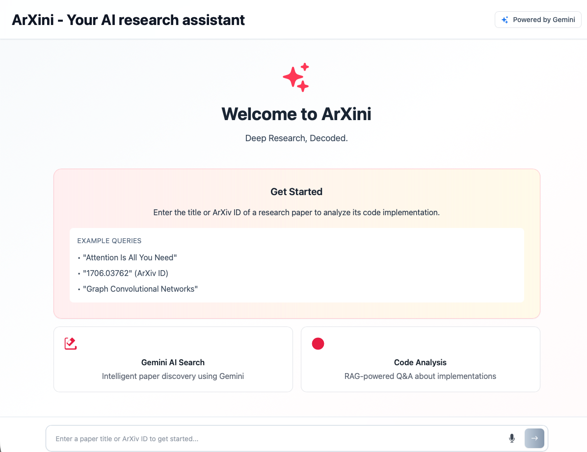

# Repo Rover (ArXini)

**Deep Research, Decoded** — An AI-powered application that bridges academic research papers to their code implementations, enabling researchers and developers to understand paper-to-code connections through intelligent Q&A.



## What It Does

Repo Rover takes an academic paper (from ArXiv), finds the GitHub repository that implements it, indexes the codebase using semantic search, and lets you ask natural language questions about how the paper's concepts are implemented in code.

**Example workflow:**
1. Search for "Attention Is All You Need"
2. The system finds the paper on ArXiv and discovers its GitHub implementation
3. The codebase is indexed into a vector database
4. Ask: *"How is the multi-head attention mechanism implemented?"*
5. Get an AI-synthesized answer linking theory from the paper to actual code snippets

## Features

- **Paper Search** — Search by title, ArXiv ID, or URL with Gemini AI-powered discovery
- **Automatic Repo Discovery** — Multimodal PDF analysis extracts GitHub links from papers
- **Semantic Code Indexing** — ChromaDB with Jina embeddings for intelligent code retrieval
- **RAG-Powered Q&A** — Ask questions and get answers that connect paper theory to code
- **Concept Mapping** — AI-generated maps linking paper concepts to code implementations
- **PDF Viewer** — Read the paper side-by-side with the chat interface
- **Voice Input** — Record spoken questions with Gemini audio transcription
- **Showcase Papers** — Pre-indexed popular papers for quick exploration
- **Session Management** — Multi-user support with 2-hour session expiry

## Tech Stack

| Layer | Technology |
|-------|-----------|
| Frontend | React 19, TypeScript, Vite |
| Backend | Python 3.11, Flask |
| AI/LLM | Google Gemini (2.5 Pro/Flash) |
| Vector DB | ChromaDB (local SQLite or cloud) |
| Embeddings | Jina Code Embeddings |
| Paper Source | ArXiv API |
| Production Server | Gunicorn |

## Project Structure

```
repo-rover/
├── frontend/                   # React/TypeScript frontend
│   ├── components/
│   │   ├── ChatPanel.tsx       # Main Q&A chat interface
│   │   ├── PdfViewer.tsx       # In-app PDF viewer
│   │   ├── VoiceRecorder.tsx   # Voice recording + transcription
│   │   └── ShowcasePapers.tsx  # Featured papers carousel
│   ├── services/
│   │   └── geminiService.ts    # Backend API client
│   ├── App.tsx                 # Main app component
│   └── types.ts                # TypeScript interfaces
│
├── backend/                    # Python Flask backend
│   ├── api_server.py           # Flask API server (all endpoints)
│   ├── session_manager.py      # User session management
│   ├── showcase_papers/        # Pre-indexed paper metadata
│   └── src/
│       ├── main.py             # CLI entry point
│       ├── discovery/
│       │   ├── paper_finder.py # ArXiv search + Gemini fallback
│       │   └── repo_finder.py  # GitHub repo extraction from PDF
│       ├── understanding/
│       │   ├── chroma_client.py      # ChromaDB wrapper
│       │   ├── code_indexer.py       # Semantic code indexing
│       │   ├── gemini_synthesizer.py # LLM synthesis
│       │   └── query_pipeline.py     # RAG pipeline
│       └── utils/
│           ├── config.py       # Configuration loader
│           ├── repo_utils.py   # Git operations
│           └── paper_cache.py  # Metadata caching
│
├── cache/                      # Paper metadata + concept maps
├── chroma_db/                  # Vector database storage
├── cloned_repos/               # Downloaded GitHub repos
├── papers/                     # Downloaded PDFs
├── requirements.txt            # Python dependencies (pip)
├── environment.yml             # Python dependencies (Conda)
└── start.sh                    # Production startup script
```

## Getting Started

### Prerequisites

- Python 3.11+
- Node.js 18+
- Git
- A [Google Gemini API key](https://aistudio.google.com/apikey)

### 1. Clone the Repository

```bash
git clone https://github.com/triablomanon/repo-rover.git
cd repo-rover
```

### 2. Set Up Environment Variables

Create a `.env` file in the project root:

```env
GEMINI_API_KEY=your_gemini_api_key_here

# Optional
GEMINI_MODEL=gemini-2.5-flash       # Default model
REPO_CLONE_DIR=./cloned_repos
CHROMA_PATH=./chroma_db
CACHE_DIR=./cache
PAPERS_DIR=./papers
DEBUG=false

# Optional: ChromaDB Cloud
CHROMA_CLOUD_API_KEY=your_cloud_key
CHROMA_CLOUD_HOST=api.trychroma.com

# Optional: GCP OAuth (for higher Gemini rate limits)
GCP_PROJECT_ID=your_project_id
GCP_CLIENT_ID=your_client_id
GCP_CLIENT_SECRET=your_client_secret
```

### 3. Install Backend Dependencies

**Using pip:**
```bash
pip install -r requirements.txt
```

**Using Conda:**
```bash
conda env create -f environment.yml
conda activate repo-rover
```

### 4. Install Frontend Dependencies

```bash
cd frontend
npm install
```

### 5. Run the Application

**Backend** (from project root):
```bash
python backend/api_server.py
# Runs on http://localhost:5000
```

**Frontend** (in a separate terminal):
```bash
cd frontend
npm run dev
# Runs on http://localhost:5173, proxies /api to localhost:5000
```

### CLI Mode

You can also use Repo Rover from the command line:

```bash
python backend/src/main.py
# or test configuration:
python backend/src/main.py --test
```

## API Endpoints

| Method | Endpoint | Description |
|--------|----------|-------------|
| `POST` | `/api/session` | Create a new user session |
| `GET` | `/api/health` | Health check |
| `POST` | `/api/search-paper` | Search for papers by query |
| `POST` | `/api/select-paper` | Select a paper from search results |
| `POST` | `/api/init-paper` | Initialize the RAG pipeline for a paper |
| `POST` | `/api/chat` | Ask a question about the loaded paper |
| `POST` | `/api/reset` | Reset the current session |
| `GET` | `/api/showcase-papers` | Get pre-indexed showcase papers |
| `POST` | `/api/init-showcase-paper` | Load a showcase paper |
| `POST` | `/api/transcribe-audio` | Transcribe audio to text |
| `GET` | `/api/cache/stats` | View cache statistics |
| `DELETE` | `/api/cache/<arxiv_id>` | Clear cache for a specific paper |
| `DELETE` | `/api/cache` | Clear all cached data |

## How It Works

### Pipeline Overview

```
User Query → ArXiv Search → Paper Selection → PDF Analysis
    ↓
GitHub Repo Discovery → Shallow Clone → Code Indexing (ChromaDB)
    ↓
User Question → Semantic Search → Code Retrieval → Gemini Synthesis → Answer
```

### Caching Strategy

The application uses three levels of caching to optimize performance:

1. **Session Cache** (in-memory) — User state, current paper/pipeline, 2-hour TTL
2. **Metadata Cache** (`cache/papers.json`) — Paper info, repo URLs, concept maps
3. **Vector Index** (`chroma_db/`) — Semantic code embeddings, persistent across sessions

Once a paper has been indexed, subsequent queries skip the expensive discovery and indexing steps entirely.

## Deployment (WIP)

### Railway

The included `start.sh` script handles production startup:

```bash
bash start.sh
# Starts Flask API with Gunicorn on $PORT (default: 5000)
```

**Gunicorn configuration:** 1 worker, 8 threads.

### Vercel (Frontend Only)

The frontend can be deployed to Vercel separately. Set `VITE_API_URL` to point to your backend host.

```bash
cd frontend
npm run build
# Deploy the dist/ directory
```

## License

This project is open source. See the repository for license details.
